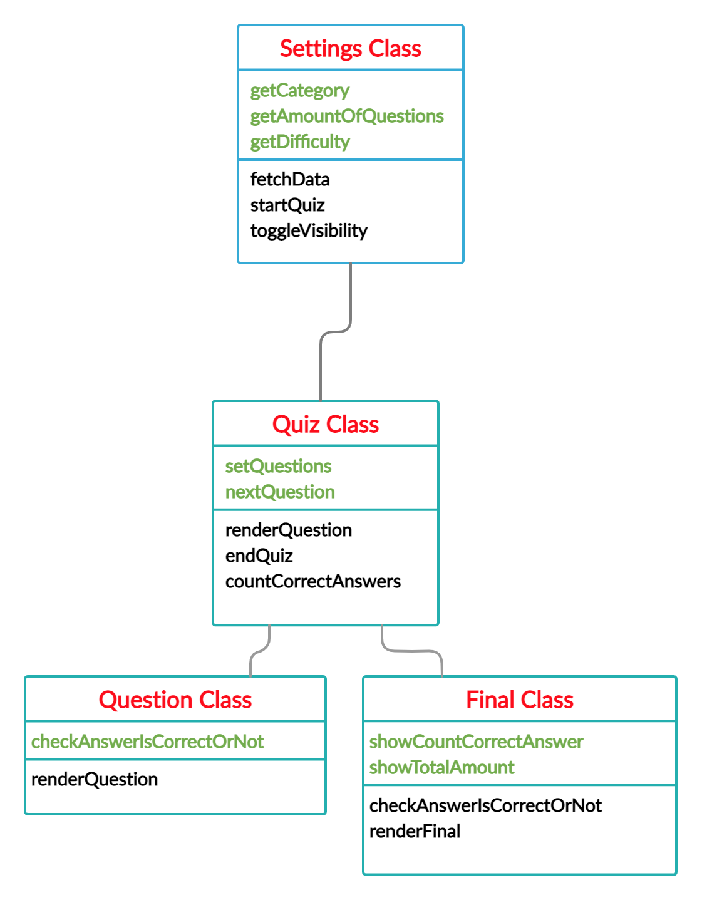

# Pure Quiz App

### This is a quiz application using vanilla JavaScript, CSS, and HTML. No additional libraries or packages.

It simulates what libraries like ReactJs do with components and rendering the output.

We will be using the [Open Trivia DB API](https://opentdb.com/api_config.php) to get the questions

## The structure of UML class diagram
the starting point for this application that showcase specific features and layouts

